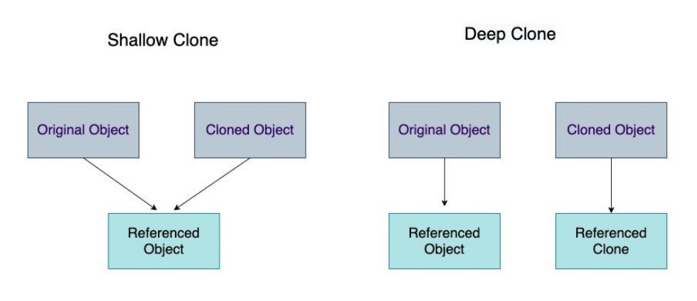

# 1️⃣4️⃣ Copy v/s Reference  :

👣 Copy and References methods for array and object 🪸.


# 📒 My Learning:

## 🧑‍💻 Primitive data types v/s Reference data type :

| Primitive data types | Reference data type |
|------|-----|
|e.g. : string,number,boolean|array,objets,object literal,functions|
|Stored in stack|in heap|
|can't change|change in copy can change in original|

## 🌚 Primitive में copy 🌝 :

```javascript

let n1 = 100;
let n2 = n1;
console.log(n1,n2); // 100 100
n1 = 101;
console.log(n1,n2); // 101 100
    
    
let name1 = 'Oza';
let name2 = 'Harsh';
console.log(name1,name2); // Oza Harsh
name1 = 'Change';
console.log(name1,name2); // Change Harsh

```
## 🎯 Array :

### 📝 Copy By Reference :

```javascript

const players = ['Wes', 'Sarah', 'Ryan', 'Poppy'];

const copy_of_players = players; //just reference to players not copy

console.log(players,copy_of_players); 
//(4) ['Wes', 'Sarah', 'Ryan', 'Poppy'] 
//(4) ['Wes', 'Sarah', 'Ryan', 'Poppy'] 


copy_of_players[2] = 'Rohit';


console.log(players,copy_of_players);
//(4) ['Wes', 'Sarah', 'Rohit', 'Poppy'] 
//(4) ['Wes', 'Sarah', 'Rohit', 'Poppy']
```


### 📝 copy by value :

+ **slice()** method :
```javascript 
// one way
const arr3 = players.slice();
arr3[0] = 'zero';
console.log(arr3);
console.log(players);

// ['zero', 'Sarah', 'Rohit', 'Poppy']
// ['Wes', 'Sarah', 'Rohit', 'Poppy']
```

+ **concat()** method :
```javascript
// or create a new array and concat the old one in
const arr4 = [].concat(players);
arr4[0]='four';
console.log(arr4);
console.log(players);

 
// ['four', 'Sarah', 'Rohit', 'Poppy']
// ['Wes', 'Sarah', 'Rohit', 'Poppy']

```
+ **spread operator** ES6 sytanx:

```javascript
// or use the new ES6 Spread
const arr5 = [...players];
arr5[0] = 'spread one';
console.log(arr5);
console.log(players);

// ['spread one', 'Sarah', 'Rohit', 'Poppy'] 
// ['Wes', 'Sarah', 'Rohit', 'Poppy']
```

+ **Array.from()** method :

```javascript
// 2nd method
const arr6 = Array.from(players);
```


## 🎯 Object :

### 🙂  Normal life :

```javascript
  const person = {
      name: 'Wes Bos',
      age: 80
    };

// and think we make a copy:
const captain = person;
captain.number = 100;

console.log(captain);
console.log(person);  
// {name: 'Wes Bos', age: 80, number: 100} 
// {name: 'Wes Bos', age: 80, number: 100}
```

### 😎 Mentos life ***(Shallow copy)*** :

+ ***Object.assign()*** method :


```javascript

const captain2 = Object.assign({},person,{number:110, status : 'Single',height : 2});
console.log(captain2);

//wes -> {name: 'Wes Bos', age: 80, number: 100}
//captain2 -> {name: 'Wes Bos', age: 80, number: 110, status: 'Single', height: 2}
```

+ ***spread operator {...}*** :

```javascript
const captain3 = {...person};
```

These methods copy to 1 level only to deep copy further level we have another methods.

+ Problems in Mentos Life :

```javascript

const wes = {
    name : 'Harsh',
    age : 200,
    social : {
        insta : 'ozaharsh.95',
        linkedin : 'ozaharsh'
    }
}

console.clear();

const dev = Object.assign({},wes);

console.log(dev.social);                // {insta: 'ozaharsh.95', linkedin: 'ozaharsh'}
dev.social.insta = 'hacker420';    
console.log(dev.social);                // {insta: 'hacker420', linkedin: 'ozaharsh'}
console.log(wes.social);                // {insta: 'hacker420', linkedin: 'ozaharsh'}
```

By changing value in copy object -> it will change value in original Object

Nested Obejcts mate Mentos life na chale : 

## 🤯 Mentos + coke life ***(deeeeep copyyy)*** :

```javascript
const dev2 = JSON.parse(JSON.stringify(wes));
dev2.social.insta = 'nonono';
console.log(dev2.social);    //{insta: 'nonono', linkedin: 'ozaharsh'} 
console.log(wes.social);
// {insta: 'hacker420', linkedin: 'ozaharsh'}
```


### 👾 How to make a deep copy in JavaScript :

According to [MDN](https://developer.mozilla.org/en-US/docs/Glossary/Deep_copy), a deep copy of an object is **a copy whose properties do not share the same references (point to the same underlying values) as those of the source object from which the copy was made**. As a result, when you change either the source or the copy, you can be assured you're not causing the other object to change too.

<p align="center">
    
</p>


### 🙏 Acknowledgement :

Special Thanks to [Kelly CHI](https://github.com/KellyCHI22) for deep copy v/s shallow copy readme and [notes](https://github.com/KellyCHI22/JavaScript30/blob/main/14-JavaScript-References-VS-Copying/README.md).
