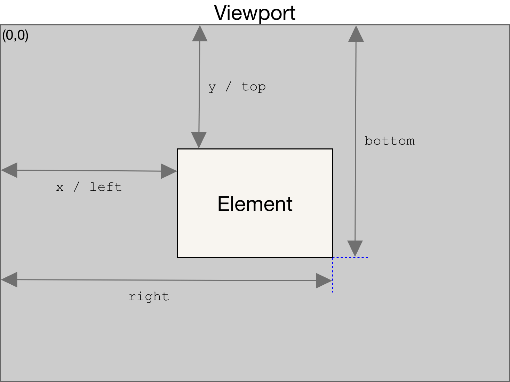

# 22 Follow Along Link :

As we hover over link it should highlighted as per link's size and shape.

# Learning :

## getBoundingClientRect() :

+ returns the relative positioning to the viewport. It returns eight properties: left, top, right, bottom, x, y, width, height. Scrolling will change the position value. 




## Dimention and Position of highlight element over links:

+ using above method we got properties of link .

+ Hight and width of highlight element <<--same--->> links'

+ But position should be updates according to scroll

```javascript

function highlightLink(){
    const linkCoords = this.getBoundingClientRect();
    console.log(linkCoords);

    const coords = {
        width : linkCoords.width,
        height : linkCoords.height,
        // we add scrollX and scrollY to postion highlight div accordingly current scroll (beacause scroll change getBoundingClientReact()'s values like top, right, bottom and left are relative to the viewport and not absolute)
        top : linkCoords.top + window.scrollY,      
        left : linkCoords.left + window.scrollX
    };

    highlight.style.width=`${coords.width}px`;
    highlight.style.height=`${coords.height}px`;

    highlight.style.transform = `translate(${coords.left}px,${coords.top}px)`;
}
```