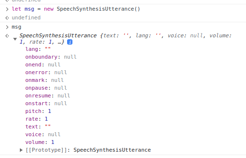

# 2️⃣3️⃣ Speech Synthesis 🚀:

text to speech in different voices.

# Learning:

## SpeechSynthesisUtterance and SpeechSynthesis interfaces :

+ They are provided by Web Speech API, deal with text-to-speech applications.

+ SpeechSynthesisUtterance : is the object contains information about speech,text,and lang.



## Properties of `SpeechSynthesisUtterance` :

+ **msg.rate**: set the speed, accepts between [0.1 - 10], defaults to 1

+ **msg.pitch**: set the pitch, accepts between [0 - 2], defaults to 1

+ **msg.volume**: sets the volume, accepts between [0 - 1], defaults to 1

+ **msg.lang**: set the language (values use a BCP 47 language tag, like en-US or it-IT)

+ **msg.text**: અંદર જે nakhie એ બોલે. Text can be maximum 32767 characters

+ **msg.voice**: sets the voice (more on this below)

## Methods for `SpeechSynthesis` :

```javascript
SpeechSynthesis.speck() // start the speech
SpeechSynthesis.cancel() // cancel the speech
SpeechSynthesis.pause() // pause the speech
SpeechSynthesis.resume() // restart the speech if paused
```
## `populateVoices()` function : 

+ fxn is called on 'voiceschanged' event.
+ `voicechanged` event : According to MDN,The voiceschanged event of the Web Speech API is fired when the list of SpeechSynthesisVoice objects that would be returned by the SpeechSynthesis.getVoices().

+ if function is not called on page load we have to call on load page

```javascript
populateVoices(); // call on page load
speechSynthesis.addEventListener('voiceschanged',populateVoices);


function populateVoices() {
    voices = this.getVoices(); // getVoices() return the currently available list of voices on system (diff system have diff built in voices)
    console.log(voices);
    voicesDropdown.innerHTML = voices.map(voice =>`<option value="${voice.name}">${voice.name}(${voice.lang}) </option>`).join('');// we add voices to dropdown menu
}
```
## `setVoice()` function :

+ function fired on when change event on dropdown menu.

+ When user select voice from dropdown, function set selected voice to object of SpeechSynthesisUtterance() (here is msg).

```javascript

voicesDropdown.addEventListener("change",setVoice);


function setVoice(){
    console.log(this.value);
    msg.voice = voices.find( voice => voice.name === this.value);
    toggle();        
}
```
## `toggle()` function :

+ ek tir se do nishan ,it start and stop speech. 

```javascript
function toggle(startOver = true){
    speechSynthesis.cancel();
    if(startOver){
        speechSynthesis.speak(msg);
    }
}
```
+ startOver flag -> true -> cancel the speech

+ startOver flag -> false -> start the speech

+ in `setOption()` fxn toggle used to restart the speech. setOption() sets parameter like rate,pitch and text to SpeechSynthesisUtterance object.

```javascript
function setOption() {
    console.log(this.name, this.value);
    msg[this.name] = this.value;
    toggle();
}
```

+ in Stop button is used to stop speech

```javascript
stopButton.addEventListener('click',function(){
    toggle(false); 
});
```
## Passing argument to function at addEventListener :

### [1] function() :

```javascript
stopButton.addEventListener('click',function(){
    toggle(false); 
});
```
### [2] Arrow function :

```javascript
stopButton.addEventListener('click',()=>toggle(false));
```
### [3] bind() method :

```javascript
stopButton.addEventListener('click', toggle.bind(null, false));
```
# References :

+ [JavaScript30/23-Speech-Synthesis/README.md at main · KellyCHI22/JavaScript30](https://github.com/KellyCHI22/JavaScript30/blob/main/23-Speech-Synthesis/README.md)

+ [JS30/23-Speech Synthesis/README.md at master · amelieyeh/JS30](https://github.com/amelieyeh/JS30/blob/master/23-Speech%20Synthesis/README.md) 

+ [webplatformcourse.com](https://webplatformcourse.com/bonus/speech-synthesis-api/)

+ [MDN web docs about voicechanged event](https://developer.mozilla.org/en-US/docs/Web/API/SpeechSynthesis/voiceschanged_event)
