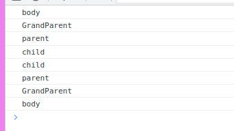
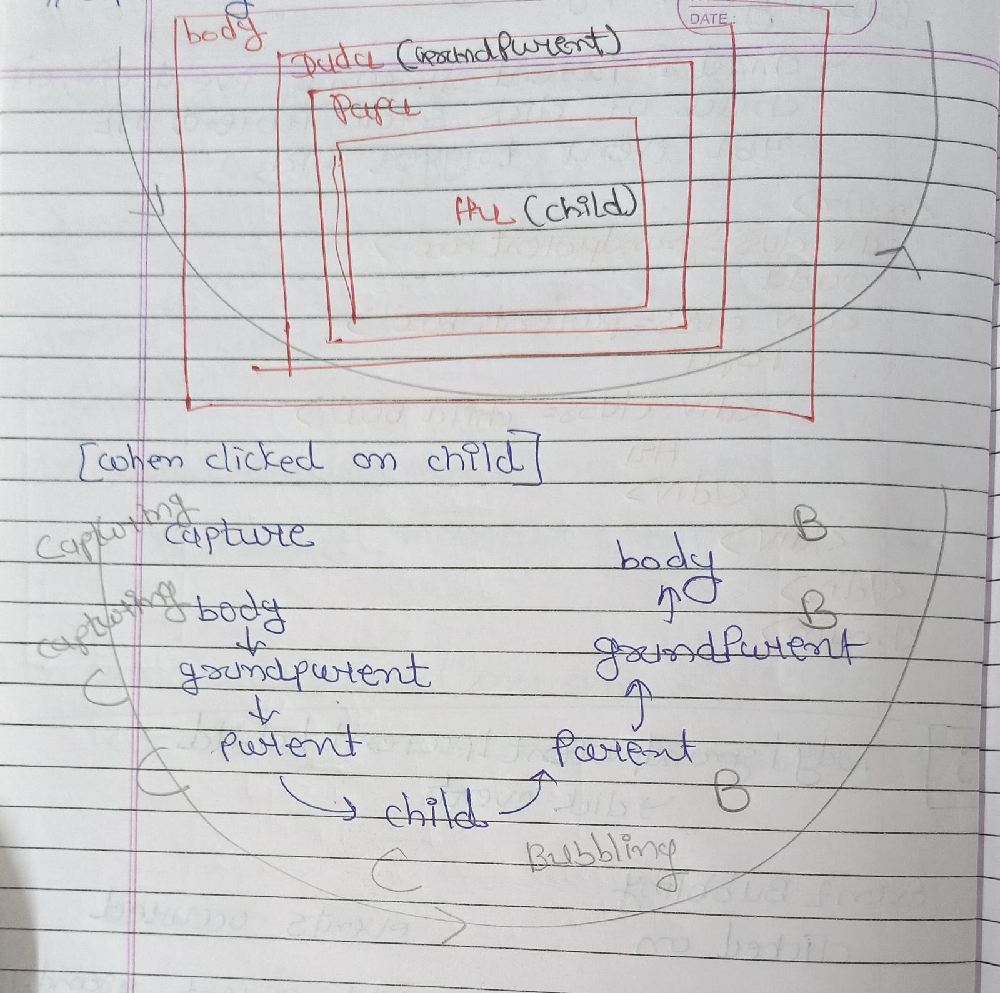

# 2️⃣5️⃣ Event Bubbling (Propagation) and Capturing 🚀:

Structure of event listener :

```javascript
<element>.addEventListener(<eventName>, 
    <callbackFunction>, {capture : boolean});
```
+ **<element>** : કે જેની સાથે event listener સંકળાયેલ છે.

+ **<eventName>** : જેતે event નું નામ જેમ કે , 'keyup' , 'click' , 'mouseenter'...

+ **<callbackFunction>** : fired when event occured

+ **boolean** : true -> event capture thay , false -> na thay.

## Soneri vakyo :

+ By default in **addEventListener()** 3rd parameter is **false** means capturing will not happen , bubbling will happen.

+ Event Bubbling ke Capturing tyare j thay jyare child ane parent element sathe same event listener attached hoy.

+ Event capturing means propagation of event is done from ancestor elements to child element in the DOM while event bubbling means propagation is done from child element to ancestor elements in the DOM.

+ The event capturing occurs followed by event bubbling.

+ If {capture: true} ,event capturing will occur else event bubbling will occur.

+ Both can be prevented by using the stopPropagation() method.

# Learning:

## Event Bubbling or Propagation :

+ Example 
```javascript

const grandParent = document.querySelector('.GrandParent');
const parent = document.querySelector('.parent');
const child = document.querySelector('.child');


document.querySelector('body').addEventListener('click',(e)=>{
    console.log('body');
},false);
grandParent.addEventListener("click",(e)=>{
    console.log("GrandParent");
},false);

parent.addEventListener("click",(e)=>{
    console.log("parent");
},false);

child.addEventListener("click",(e)=>{
    console.log("child");
},false);
```
+ Output :

|WHEN WE CLICKED ON ELEMENT|OUTPUT|
|------|-----|
|CHILD |CHILD -> PARENT -> GRANDPARENT -> BODY|
|PARENT|PARENT -> GRANDPARENT -> BODY|
|GRANDPARENT|GRANDPARENT -> BODY|
|BODY|BODY|


SO BASICALLY WHEN WE HAVE SAME EVENT LISTENER ATTACHED TO CHILD AND ANESTORS,
WHEN WE CLICK ON CHILD THEN FROM INSIDE TO OUTSIDE ALL EVENT LISTENER'S FUNCTION TRIGGERED.

PROPOGATION MOVES -> INSIDE TO OUTSIDE

## Event Capturing :
+ Example :

```javascript


const grandParent = document.querySelector('.GrandParent');
const parent = document.querySelector('.parent');
const child = document.querySelector('.child');


document.querySelector('body').addEventListener('click',(e)=>{
    console.log('body');
},true);
grandParent.addEventListener("click",(e)=>{
    console.log("GrandParent");
},true);

parent.addEventListener("click",(e)=>{
    console.log("parent");
},true);

child.addEventListener("click",(e)=>{
    console.log("child");
},true);

```

+ OUTPUT :


|WHEN WE CLICKED ON ELEMENT|OUTPUT|
|------|-----|
|CHILD |BODY -> GRANDPARENT -> PARENT -> CHILD|
|PARENT|BODY -> GRANDPARENT -> PARENT|
|GRANDPARENT|BODY -> GRANDPARENT|
|BODY|BODY|

EVENT CAPTURING MA FLOW OUTER MOST PARENT THI CHILD TARAF HOY(FLOW WILL BE FROM ANESTORS TO CHILD)

FLOW -> OUTER TO INNER

## Bubbling + Capturing :

+ Example :

```javascript

const grandParent = document.querySelector('.GrandParent');
const parent = document.querySelector('.parent');
const child = document.querySelector('.child');


document.querySelector('body').addEventListener('click',(e)=>{
    console.log('body');
},false);
grandParent.addEventListener("click",(e)=>{
    console.log("GrandParent");
},false);

parent.addEventListener("click",(e)=>{
    console.log("parent");
},false);

child.addEventListener("click",(e)=>{
    console.log("child");
},false);

document.querySelector('body').addEventListener('click',(e)=>{
    console.log('body');
},true);
grandParent.addEventListener("click",(e)=>{
    console.log("GrandParent");
},true);

parent.addEventListener("click",(e)=>{
    console.log("parent");
},true);

child.addEventListener("click",(e)=>{
    console.log("child");
},true);
```

+ OUTPUT :




+ First capturing occur : from body to child  :  body -> grandparent -> parent -> child

+ then bubbling occure  : from child to body  :  child -> parent -> grandparent -> body



## stopPropagation() :

+ It stops bubbling and capturing.

+ if we apply **stopPropogation()** to any element

    + if 3 rd parameter is **false** or **not mentioned** -> stopPropogation() prevents **bubbling from that element to parent**

    + if 3rd parameter is **true** ->  stopPropogation() **prevents capturing from that element to child**

+ Example of stopPropagation() in Bubbling :

```javascript

const grandParent = document.querySelector('.GrandParent');
const parent = document.querySelector('.parent');
const child = document.querySelector('.child');

document.querySelector('body').addEventListener('click',(e)=>{
    console.log('body');
},false);

grandParent.addEventListener("click",(e)=>{
    e.stopPropagation();            // prevent bubbling from grandparent to body
    console.log("GrandParent");
},false);

parent.addEventListener("click",(e)=>{
    e.stopPropagation();       // prevents bubbling from parent to grandparent
    console.log("parent");
},false);

child.addEventListener("click",(e)=>{
    console.log("child");
},false);

//OUTPUT
/*
child
parent
*/
```

+ Example of stopPropagation() in Capturing :
```javascript

const grandParent = document.querySelector('.GrandParent');
const parent = document.querySelector('.parent');
const child = document.querySelector('.child');

document.querySelector('body').addEventListener('click',(e)=>{
    console.log('body');
},true);

grandParent.addEventListener("click",(e)=>{
    e.stopPropagation();            // prevent capturing from grandparent to parent
    console.log("GrandParent");
},true);

parent.addEventListener("click",(e)=>{
    e.stopPropagation();       // prevents capturing from parent to child
    console.log("parent");
},true);

child.addEventListener("click",(e)=>{
    console.log("child");
},true);

/*
OUTPUT

body
Grandparent

*/
```

# References :

+ [What is Event bubbling and Event Capturing in JavaScript ? - GeeksforGeeks](https://www.geeksforgeeks.org/what-is-event-bubbling-and-event-capturing-in-javascript/)
