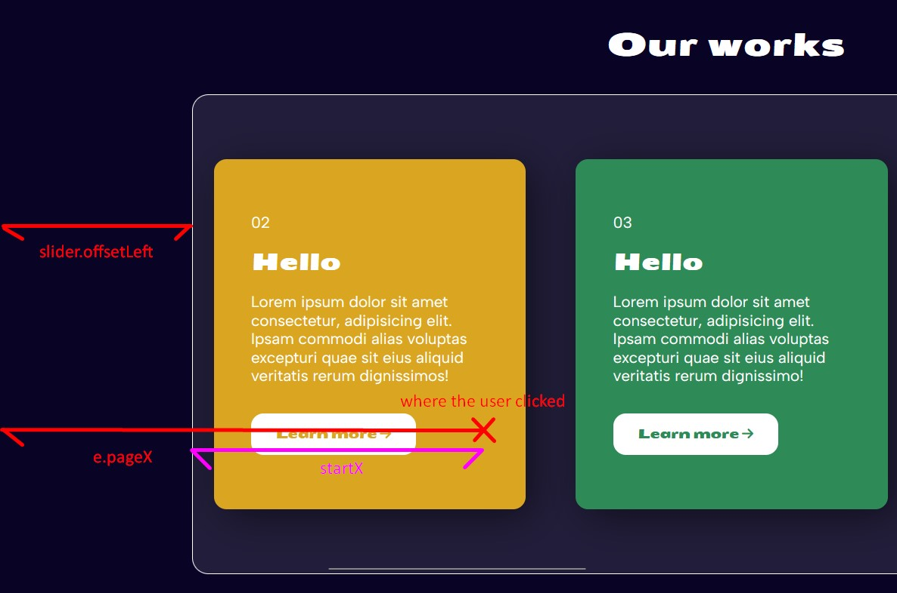

# 27 Click and drag :

Horizontal drag and scrolling effect 

# Learning :

## Use of flag to detect click and drag movement of mouse :

+ We have to drag horizonatlly when we clicked (so mousedown event occur) && drag (so  mousemove occur)

+ here in code `isDown` is used to detect these state.

```javascript
let isDown = false;

slider.addEventListener('mousedown', (e) => {
    isDown = true;
});

slider.addEventListener('mouseleave', () => {
    isDown = false;    // No drag while moving
});

slider.addEventListener('mouseup', () => {
    isDown = false;    // No drag while moving
});

slider.addEventListener('mousemove', (e) => {
    if (!isDown) return;  // it checks is mouse is pressed or not . if not it wont executed
});
```

## Calculation of scrolling slider:



As kelly explained in diagram that 
    
+ `e.pageX` is X coordinate where mouse is clicked.

+ `slider.offsetLeft` is distance from page start and left border of slider.

+ So when we click on slider we get Initial position of mouse through ` startX = e.pageX - slider.offsetLeft;`

+ `scrollLeft = slider.scrollLeft;` It also captures the initial horizontal scroll position of the slider in the 'scrollLeft' variable.

```javascript
slider.addEventListener('mousedown', (e) => {
    isDown = true;
    slider.classList.add('active');
    startX = e.pageX - slider.offsetLeft;
    scrollLeft = slider.scrollLeft;
});
```


+ Now we clicked mouse we drag to slide the slider,

```javascript
slider.addEventListener('mousemove', (e) => {
    if (!isDown) return;  // stop the function from running
    e.preventDefault();
    const x = e.pageX - slider.offsetLeft;
    const walk = (x - startX) * 3;
    slider.scrollLeft = scrollLeft - walk;
});
```

+ Here we again calculate current position of mouse x co-ordinate and subtract from `startX` which was previus position to get how much we have to scroll. 

+ x -> currrent position of mouse x coordinate

+ walk = current position - previus position.

+ if the user moves the mouse to the right, the slider should scroll to the left, so 'scrollLeft' is decreased.


# References :

+ [Implementation of kelly chiii][1]

[1]: https://github.com/KellyCHI22/JavaScript30/blob/main/27-Click-and-Drag/README.md