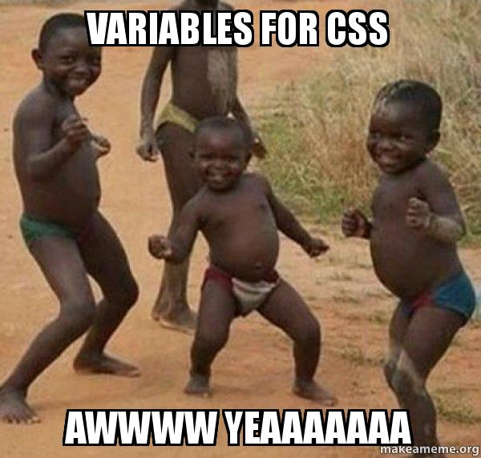

# 3️⃣  CSS Variable 👾 

<!--  -->

I was also surprised to learn about CSS variables for the first time.

# 📒 My Learning:

### ✏️  CSS Variable :

Declaring variables in style tag or .css file

```CSS
      /* Two hyphens (--) followed by the variable name */

      :root {
        --base: #ffc600;
        --blur: 10px;
        --padding: 10px;
      }
```

Using variables

```CSS
      /* 'var(--variableName)' to use previously defined CSS properties */

      img {
        background: var(--base);
        filter: blur(var(--blur));
        padding: var(--padding);
      }
```

### ✏️  input type="color" :

 ```html
 <label for="base">Base Color</label>
        <input type="color" name="base" value="#ffc600">
 ```

### ✏️ document.documentElement v/s document.getRootNode()

📌 Concept is Node v/s Element in DOM

| Element      | Node |
| ----------- | ----------- |
| Only HTML Elements like  <body> <span> <div>     |    HTML Elements , text , comments    |
| Every Element is a node   | Reverse ❌ |

Example Code:

Html :

```html
<!DOCTYPE html>
<html lang="en">
<head>
    <title>Document</title>
</head>
<body>
    <h3>Hello</h3>
</body>
</html>
```

Javascript :

```javascript
console.log(document.documentElement);

//it will give root Element

//Output:
/*<html lang="en"><head>
    <title>Document</title>
</head>
<body>
    <h3>Hello</h3>
    <script>
        console.log(document.documentElement);
        console.log(document.getRootNode());
    </script>

</body></html>*/

console.log(document.getRootNode());

//it will give root Node

//Output:
/*
<!DOCTYPE html>
<html lang="en">
<head>
    <title>Document</title>
</head>
<body>
    <h3>Hello</h3>
    <script>
        console.log(document.documentElement);
        console.log(document.getRootNode());
    </script>
</body>
</html>
*/

```
📌 HTMLCollection v/s NodeList

| Element      | Node |
| ----------- | ----------- |
| Methods such as **getElementsByClassName()** and **children** return **HTMLCollection** | Methods such as **querySelectorAll()** and **childnodes** return **NodeList**|

📌 children v/s childNodes

```javascript
console.log(root.childNodes);
//NodeList(3) [head, text, body]

console.log(root.children);
//HTMLCollection(2) [head, body]

```

In detailes of these methods covered in part2/DOM of [Harshit Vashisth's playlist](https://github.com/ozaharsh95/JS_BEGINNING_TO_MASTERY).

